<div align="center">
  


</div>

# Road Hunter - Game built on AK Embedded Base Kit

<center>
<table align="center">
  <tr>
    <td align="center">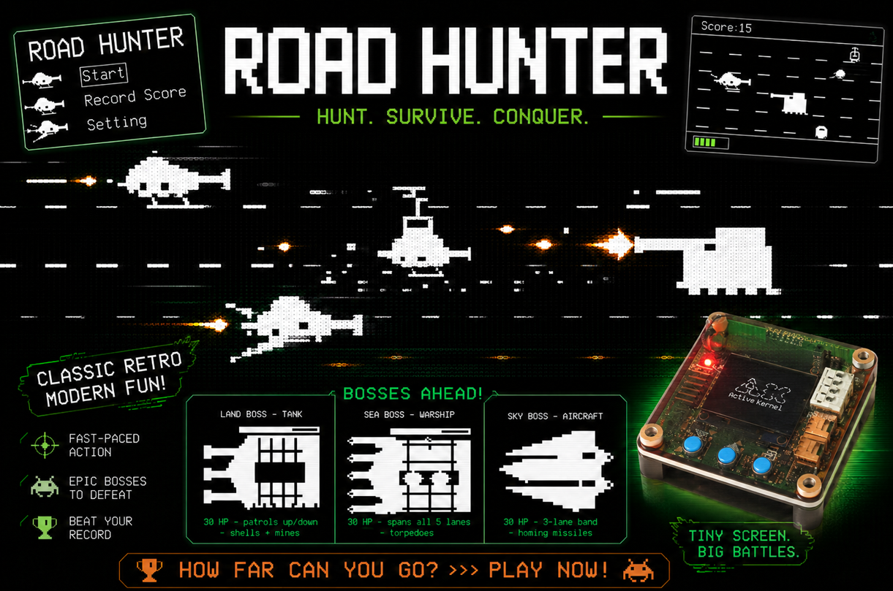</td>
  </tr>
</table>


<hr>

## Gameplay Demo

<div align="center">
  


https://github.com/user-attachments/assets/6385d0b3-5b24-42fc-b9e3-5209179a20fa

</div>


  

## Documentation

| File | Description |
|---|---|
| [README.md](README.md) | Main project overview, hardware information, gameplay rules, and object descriptions. |
| [docs/01-guide-getting-started.md](docs/01-guide-getting-started.md) | Game programming getting started guide. |
| [docs/02-guide-coding-rules.md](docs/02-guide-coding-rules.md) | Some rules for coding game. |
| [docs/03-design-sequence-object.md](docs/03-design-sequence-object.md) | Runtime sequence diagrams for gameplay objects: Player, Bullet, Enemy, Obstacle, Chest, and Boss. |
| [docs/04-design-sequence-runtime.md](docs/04-design-sequence-runtime.md) | Runtime signal-processing flow for button input, game-loop ticks, object updates, and Mermaid sequence diagrams. |

## Introduction

Road Hunter is an action shooting racer game built on top of the AK Embedded Base Kit — a hands-on platform for embedded programming enthusiasts to explore event-driven design in depth. While building and playing Road Hunter, you put the following core concepts of modern embedded engineering into practice:

- **System design:** Modelling complex logic flows with UML.
- **Process management:** Coordinating cooperative Tasks and scheduling them efficiently.
- **Communication:** Using Signals, Timers, and Messages to react in real time.
- **Control logic:** Building robust state machines for the player, the Bosses, and the overall match progression.

### I. Hardware

<p align="center">
  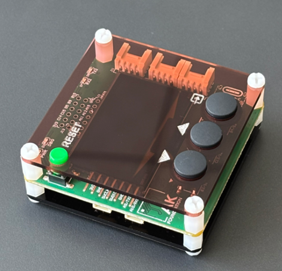
</p>

<p align="center">

</p>
<p align="center"><strong><em>Figure 1:</em></strong> AK Embedded Base Kit - STM32L151</p>

[AK Embedded Base Kit](https://epcb.vn/products/ak-embedded-base-kit-lap-trinh-nhung-vi-dieu-khien-mcu) is an evaluation kit aimed at intermediate and advanced embedded software learners.

The kit integrates a **1.54" OLED LCD**, **3 push buttons**, and **a buzzer** capable of playing short melodies, giving you everything you need to study **event-driven systems** through hands-on game-machine design.
It also exposes **RS485**, the **Qwiic Connect System**, and **Grove** connectors, so it doubles as a convenient prototyping board for real-world embedded projects.

**MCU Overview:**


<pre>

SoC Name : STM32L151CBT6
RAM      : 16 KB

Flash Partitions Layout
----------------------
[ 0x08000000 - 0x08001FFF ] : Bootloader Partition (8 KB)
=> AK Bootloader

[ 0x08002000 - 0x08002FFF ] : BSF Shared Partition (4 KB)
=> Used for data sharing between Bootloader and Application

[ 0x08003000 - 0x0801FFFF ] : Application Partition (116 KB)
=> Road Hunter firmware

</pre>

</div>

**MCU Naming Convention:**

| Part | Meaning |
|---|---|
| `STM32` | STMicroelectronics 32-bit MCU family. |
| `L` | Low-power series. |
| `151` | STM32L151 product line. |
| `C` | 48-pin package. |
| `B` | 128 KB Flash memory. |
| `T` | LQFP package. |
| `6` | Industrial temperature grade. |


<p align="center">
  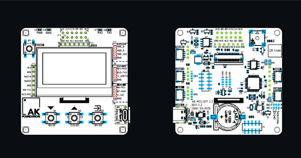
</p>

<p align="center">
  
<p align="center"><strong><em>Figure 2:</em></strong> Board view Top + Bottom </p>

### II. Game Description and Objects

The following section describes the gameplay and core mechanics of **"Road Hunter"**. It serves as a reference for ongoing game design and firmware development.

<p align="center">
  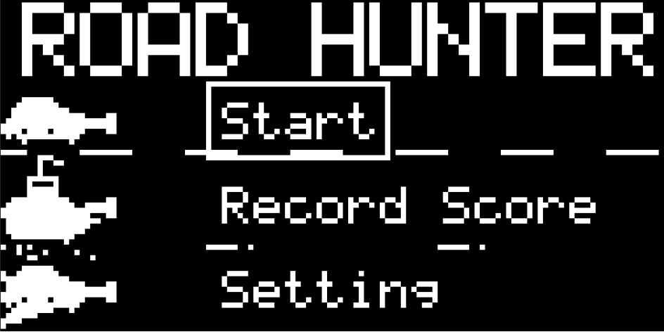
</p>

<p align="center">
  
<p align="center"><strong><em>Figure 3:</em></strong> Menu screen</p>

The game opens on the **Main Menu**, which offers the following options:

- **Start:** Begin the battle. The player's vehicle spawns on the middle lane and starts rushing forward.
- **Record Score:** View the highest score achieved.
- **Setting:** Configure sound settings (toggle Sound On/Off).

<p align="center">
  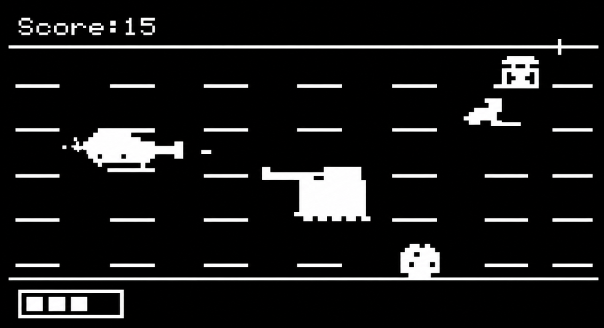
</p>

<p align="center">
  
<p align="center"><strong><em>Figure 4:</em></strong> Gameplay screen</p>

#### Objects in the Game:

| Bitmap | Object Name | Description |
| :---: | :--- |:--- |
| 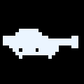 | **Player (Car)** | The player's vehicle, positioned on the left side of the screen. Moves vertically between the 5 road lanes when pressing **[Up]** or **[Down]**. Holding the **[Mode]** button lets you shoot bullets. Swaps to a Boat hull in sea environments and sprouts Wings in sky battles. |
| 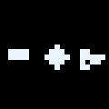 | **Bullet / Laser** | Projectiles fired by the player. Upgrades collected from Chests modify bullet characteristics: **Gatling** (rapid fire), **Piercing** (travels through objects), **Explosive** (causes splash damage), **Spider** (traps enemies), **Laser** (lane sweeps), and **Shield** (invincibility block). |
|  | **Enemy Buggy** | Light attack vehicles that speed from the right to the left. Getting hit by one destroys the player. |
|  | **Enemy Tank** | Big armored tanks with high health (2 HP). They occasionally fire bursts of 3 rockets towards the player. |
| 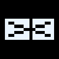 | **Obstacles** | Street blocks including traffic cones, road fences, cargo crates, trucks, and parked cars that scroll left. Crashing into one kills the player. |
|  | **Chest** | Supply crates containing random weapon power-ups. Collecting one upgrades the player's weapon for ~10 seconds. |
| 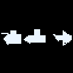 | **Bosses** | Mega-bosses appearing on a timer: **Land Tank** (patrols up/down, spawns shells and mines), **Sea Warship** (occupies all 5 lanes, fires torpedoes), and **Sky Aircraft** (flies in a 3-lane band, shoots homing missiles). Each has 30 HP and exposes temporary weak points. |

> **Note:** All bitmaps above are pixel-accurate re-renders of the actual monochrome sprites drawn on the kit's 128x64 OLED (see `application/sources/app/screens/scr_game_bitmap.cpp` and `scr_road_hunter.cpp`). Full-size, labeled versions of every object -- including the Player's Boat/Plane forms, every bullet type, every obstacle variant, and all 3 bosses -- are in the [Game Objects Gallery](#game-objects-gallery) below.

> **Note:** For detailed object runtime sequences, see [Game Object Sequences](docs/03-design-sequence-object.md).

#### Game Objects Gallery

All sprites below are rendered 1:1 from the game's own drawing code (`bitmap_car`, `bitmap_tank`, `bitmap_chest`, ... plus the vector `fillRect`/`fillTriangle` shapes for enemies, obstacles, and bosses), scaled up for readability. On the real 1.54" OLED they appear as crisp monochrome pixels only a few millimeters tall.

**Player forms** -- the car swaps hull depending on which boss is active:

<table align="center">
  <tr>
    <td align="center">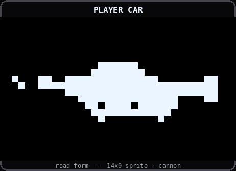</td>
    <td align="center">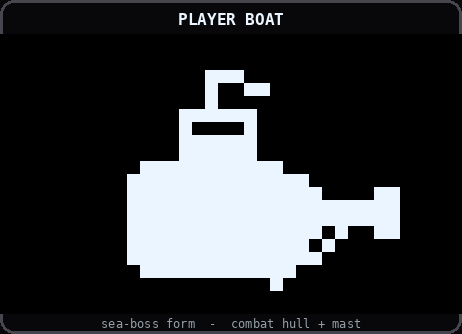</td>
    <td align="center">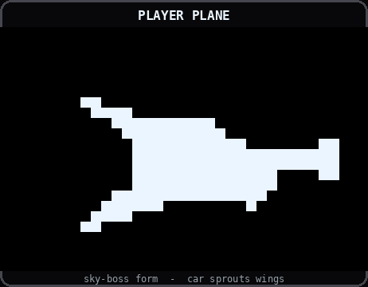</td>
  </tr>
</table>

**Bullet types** -- shape changes with the active weapon power-up:

<p align="center">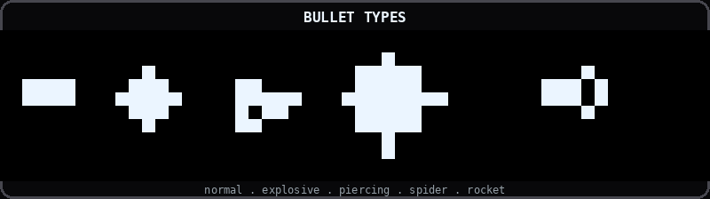</p>

**Road enemies:**

<table align="center">
  <tr>
    <td align="center">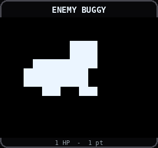</td>
    <td align="center">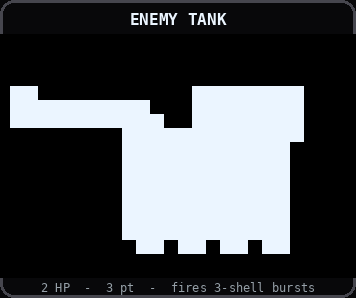</td>
  </tr>
</table>

**Obstacles** -- traffic cone, cargo crate, parked car, truck, and road fence:

<table align="center">
  <tr>
    <td align="center">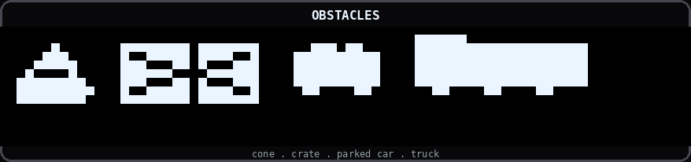</td>
  </tr>
  <tr>
    <td align="center">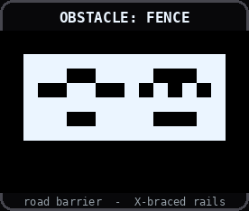</td>
  </tr>
</table>

**Chest & explosion:**

<table align="center">
  <tr>
    <td align="center">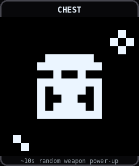</td>
    <td align="center">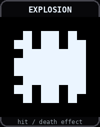</td>
  </tr>
</table>

**Bosses** -- Land Tank, Sea Warship, and Sky Aircraft, each with 30 HP and a blinking weak-point hatch:

<table align="center">
  <tr>
    <td align="center">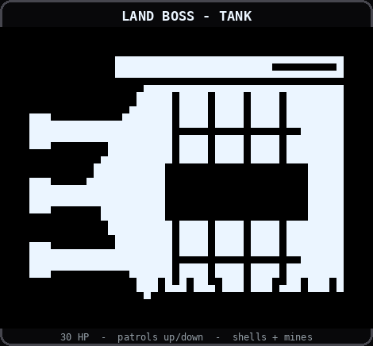</td>
    <td align="center">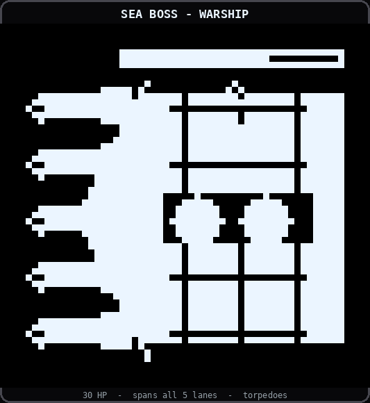</td>
    <td align="center">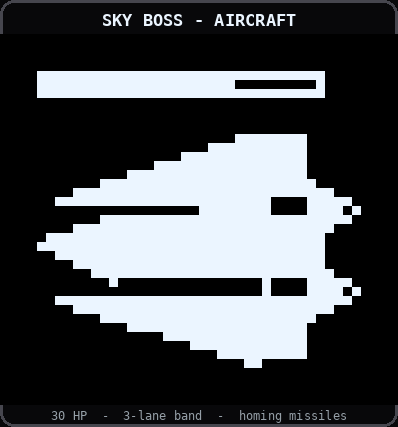</td>
  </tr>
</table>

### III. How to Play:

- You control the **Player Car**. Use the **[Up]** and **[Down]** buttons to switch lanes (5 lanes available).
- Press and hold the **[Mode]** button to fire bullets at incoming obstacles and enemies.
- Dodge all obstacles (fences, cones, trucks) and enemies scrolling left.
- Destroy enemies to score points and drop Chest power-ups to upgrade your shooting style.
- Survive periodically triggered Boss fights by shooting their blinking weak-point slots and dodging their missiles.

#### Game Mechanics:

- **Scoring:**
  - Destroying a Buggy or small obstacle yields **1 point**.
  - Destroying a Tank enemy yields **3 points**.
  - Destroying a Truck/Big Car yields **2 points**.
  - Defeating any Boss yields **50 points**.
- **Difficulty Scaling:** Over time, the scroll speed of the road and entities increases based on the elapsed tick count (`move_speed = ROAD_ENEMY_SPEED_BASE + 1 + (rh_game_tick / 140)`), capped at speed 8.
- **"Cuong hoa" (Empower):** Destroying tank enemies fills a 5-pip empower bar. Once fully charged, the player becomes invincible, rams through all enemies, moves faster, and cannot pick up weapon chests for ~10 seconds.
- **Boss Fights:** Every 20 seconds, a boss encounter triggers. Normal road entities are cleared, and the active boss slides in. Bosses have 30 HP. Defeating the boss resumes normal road scrolling.
- **Game Over:** Colliding with an enemy, obstacle, or boss projectile while unprotected results in immediate death. A falling "GAME OVER" screen plays, the score is compared with the record, and the UI shifts to the Retry/Menu summary screen.

<p align="center">
  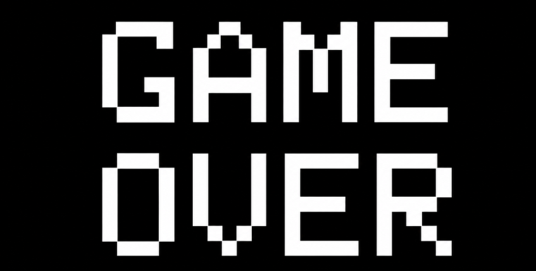
</p>

<p align="center">

<p align="center">
  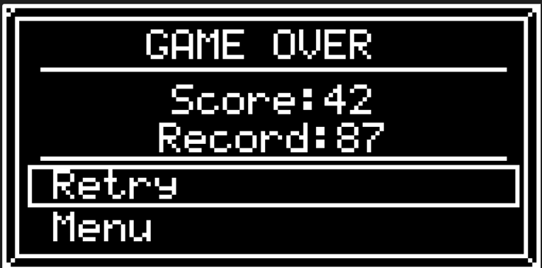
</p>

<p align="center">

  </tr>
</table>
<p align="center"><strong><em>Figure 5:</em></strong> Game Over screen</p>

### IV. Basic Game Sequence Logic

> **Note:** For a more detailed sequence flow, see [Runtime Signal Processing](docs/04-design-sequence-runtime.md).

```mermaid
%%{init: {'theme':'base','themeVariables':{'fontSize':'16px','primaryColor':'#1565c0','primaryTextColor':'#ffffff','primaryBorderColor':'#0d47a1','lineColor':'#90a4ae','signalColor':'#ffc107','signalTextColor':'#ffc107','actorBkg':'#1565c0','actorBorder':'#0d47a1','actorTextColor':'#ffffff','actorLineColor':'#90caf9','noteBkgColor':'#fff59d','noteTextColor':'#000000','noteBorderColor':'#f57f17','activationBkgColor':'#66bb6a','activationBorderColor':'#2e7d32','sequenceNumberColor':'#ffffff','loopTextColor':'#ffc107','labelBoxBkgColor':'#37474f','labelBoxBorderColor':'#90a4ae','labelTextColor':'#ffffff'},'sequence':{'actorMargin':90,'messageFontSize':15,'noteFontSize':14,'actorFontSize':15,'boxMargin':12,'boxTextMargin':6,'noteMargin':10,'useMaxWidth':false}}}%%
sequenceDiagram
    autonumber
    actor Player as Player
    participant Screen as Screen
    participant Core as Core
    participant PlayerMod as PlayerMod
    participant Bullet as Bullet[n]
    participant Enemy as Enemy[n]
    participant Obstacle as Obstacle[n]
    participant Chest as Chest[n]
    participant Boss as Boss
    participant Timer as Timer
    participant GameOver as GameOver

    rect rgb(30,35,42)
    Note over Player,GameOver: SCREEN_ENTRY
    Player->>Screen: SCREEN_ENTRY
    activate Screen
    Note over Screen: screen_clear()
    Screen->>Core: rh_game_reset_round()
    activate Core
    Core->>PlayerMod: rh_game_player_reset()
    Core->>Enemy: rh_game_enemy_reset()
    Core->>Obstacle: rh_game_obstacle_reset()
    Core->>Bullet: rh_game_bullet_reset()
    Core->>Chest: rh_game_chest_reset()
    Core->>Boss: rh_game_boss_reset()
    Core-->>Screen: 
    deactivate Core
    Screen->>Timer: timer_remove_attr(SCREEN_IDLE)
    Screen->>Timer: timer_set(SCREEN_IDLE, 12000ms, ONE_SHOT)
    Screen->>Timer: timer_set(RH_GAME_TICK, 120ms, PERIODIC)
    Note over Screen: STATE PLAYING, Score 0, tick 0, spawn_timer 12
    deactivate Screen
    end

    rect rgb(30,35,42)
    Note over Player,GameOver: GAME_PLAY (every 120 ms)
    Timer--)Screen: AC_DISPLAY_RH_GAME_TICK
    activate Screen
    opt State is PLAYING
        Screen->>Core: rh_game_update()
        activate Core
        Note over Core: compute difficulty and move_speed (cap 8)
        alt Boss Active
            Core->>Boss: rh_game_boss_update(move_speed)
            Core->>Bullet: rh_game_bullet_autoshoot()
            Core->>Bullet: rh_game_bullet_update()
            Core->>Boss: rh_game_boss_check_bullet_hits()
        else Normal Road
            Note over Core: decrement spawn_timer / random roll
            Core->>Enemy: rh_game_enemy_spawn() / spawn_tank()
            Core->>Obstacle: rh_game_obstacle_spawn()
            Core->>Chest: rh_game_chest_spawn()
            Core->>Enemy: rh_game_enemy_update(move_speed)
            Core->>Obstacle: rh_game_obstacle_update(move_speed)
            Core->>Chest: rh_game_chest_update(move_speed)
            Core->>Bullet: rh_game_bullet_autoshoot()
            Core->>Bullet: rh_game_bullet_update()
        end
        Note over Core: rh_game_explosion_update(), increment rh_game_tick
        Core-->>Screen: 
        deactivate Core
    end
    deactivate Screen
    end

    rect rgb(30,35,42)
    Note over Player,GameOver: ACTION (button input, handled synchronously)
    Player->>Screen: Button [UP] -> AC_DISPLAY_BUTON_UP_PRESSED
    activate Screen
    opt rh_player_lane is greater than 0
        Screen->>PlayerMod: rh_game_player_move_up()
        Note over Screen: BUZZER_PlaySound(CLICK)
    end
    deactivate Screen
    Player->>Screen: Button [DOWN] -> AC_DISPLAY_BUTON_DOWN_PRESSED
    activate Screen
    opt rh_player_lane is less than LANE_COUNT minus 1
        Screen->>PlayerMod: rh_game_player_move_down()
        Note over Screen: BUZZER_PlaySound(CLICK)
    end
    deactivate Screen
    end

    rect rgb(30,35,42)
    Note over Player,GameOver: GAME_OVER and EXIT
    Note over Enemy,Obstacle: Collision detected inside enemy_update / obstacle_update
    Core->>Core: rh_game_trigger_over()
    Note over Core: STATE GAME_OVER, rh_state_timer = 24, BUZZER_SOUND_LOWSCORE
    loop Next 24x AC_DISPLAY_RH_GAME_TICK (~2.8 s)
        Timer--)Screen: AC_DISPLAY_RH_GAME_TICK
        activate Screen
        Note over Screen: decrement rh_state_timer, draw falling GAME OVER text
        deactivate Screen
    end
    Screen->>Timer: timer_remove_attr(RH_GAME_TICK)
    Screen->>GameOver: SCREEN_TRAN(scr_rh_game_over_handle)
    end
```

<p align="center"><strong><em>Figure 6:</em></strong> Game sequence logic</p>

## Contact & Support

<p style="font-size: 20px;"><strong>Phan Minh Hien</strong> - Software Engineer - Embedded Systems</p>

``` Note
Thank you for visiting this repository.
If you have any questions, suggestions, or feedback about this project or firmware development, feel free to contact me directly.
```

<a href="https://github.com/PhanMinhHien04">
  
</a>

<a href="https://www.linkedin.com/in/hien-phan-37337540b/">
  
</a>

<a href="mailto:phanminhhien2004@gmail.com">
  
</a>
