<h1 align="center">Game programming getting started guide</h1>

Welcome to the game programming project on the STM32L151 microcontroller! This repository provides a foundational source code base along with detailed documentation to help you quickly get familiar with the system architecture and start building your own game.

---

## Table of Contents

- [I. Create Your Own "Playground" (Fork)](#i-create-your-own-playground-fork)
- [II. Quick Start Guide (Environment Setup)](#ii-quick-start-guide-environment-setup)
- [III. Game Programming Workflow](#iii-game-programming-workflow)
  - [Step 1: Create your working directory](#step-1-create-your-working-directory)
  - [Step 2: Clone the repo to your machine](#step-2-clone-the-repo-to-your-machine)
  - [Step 3: Modify the Game](#step-3-modify-the-game)
  - [Step 4: Push your code to GitHub](#step-4-push-your-code-to-github)

---

## I. Create Your Own "Playground" (Fork)

To initialize your personal project, follow these steps:

### 1. Access the original repository

**Link:** [https://github.com/the-ak-foundation/ak-base-kit-stm32l151](https://github.com/the-ak-foundation/ak-base-kit-stm32l151)

### 2. Fork the repository

Click the **Fork** button in the top-right corner to create a copy of the project under your personal account.
You can also click the **Star** button next to **Fork** to support the author.

<p align="center">
  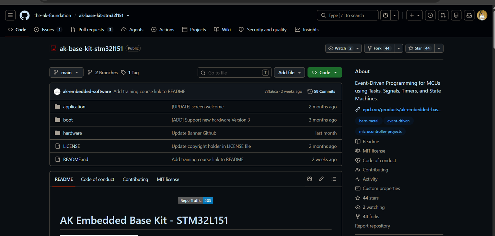

  

### 3. Create the fork

<p align="center">
  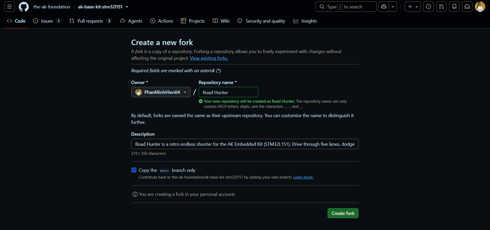


  

> **Note:**
> - Name the repository after **your game's name** (e.g. `road-hunter-game`).
> - Add a brief description of your game in the **Description** field.

Once the fork is created, GitHub redirects you to the new repository — this is the "skeleton" you will use to develop and complete your game:

<p align="center">
  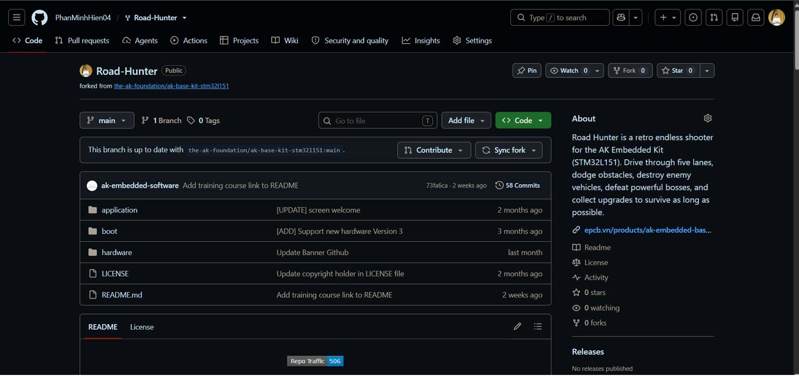

  

---

## II. Quick Start Guide (Environment Setup)

To build the source code and flash firmware onto the kit, you need to set up the development environment on Ubuntu/Linux. Step-by-step instructions are available here:

**[AK Embedded Base Kit STM32L151 — Getting Started](https://epcb.vn/blogs/ak-embedded-software/ak-embedded-base-kit-stm32l151-getting-started)**

---

## III. Game Programming Workflow

> **Note:** Since this is an embedded software project, you should use the **Terminal on an Ubuntu/Linux environment** to ensure the build and flashing process runs correctly.

### Step 1: Create your working directory

From your `Home` directory, create a folder named **Workspace** — this will hold all of your source code and programming tools.

<p align="center">
  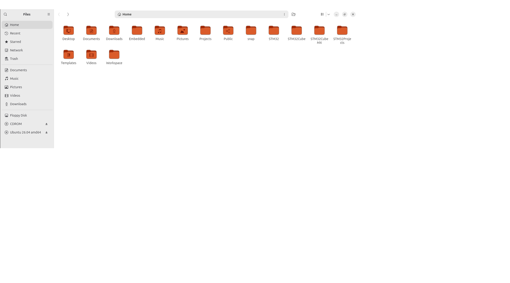

  

Inside `Workspace`, create two subdirectories:

| Directory | Purpose                                                                                       |
| --------- | --------------------------------------------------------------------------------------------- |
| `Sources` | Holds your programming projects                                                               |
| `Tools`   | Holds the programming tools (see details in [Section II](#ii-quick-start-guide-environment-setup)) |

<p align="center">
  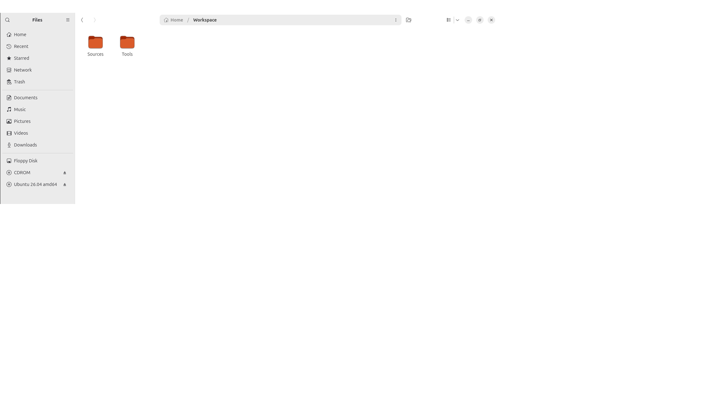

  

---

### Step 2: Clone the repo to your machine

> **Note:** This step only needs to be done **once** when starting the project.

Open a **Terminal** inside the `Sources` directory and run the following command (replace the URL with your own repository link):

```bash
git clone https://github.com/<your-username>/<your-cloned-repo-name>.git

```

<p align="center">
  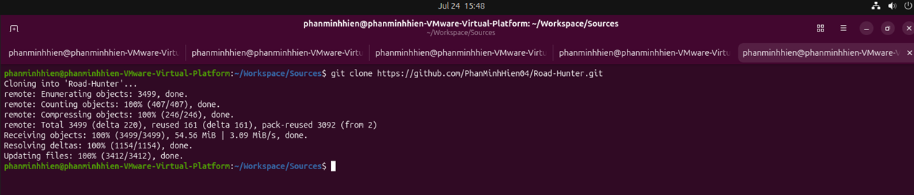


  

---

### Step 3: Modify the Game

Open **VSCode** on Linux, then open the freshly cloned repository to start coding.

First, set your game's name in the `Makefile.mk` file located in the `application/` directory:

<p align="center">
  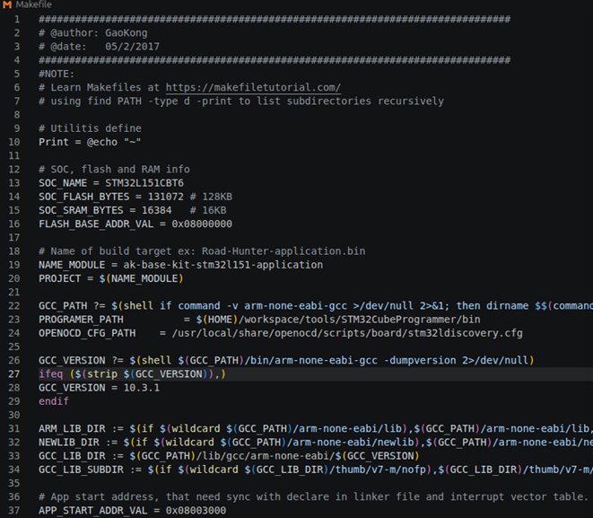

  

All game logic lives in the `application/sources/app` directory.

<p align="center">
  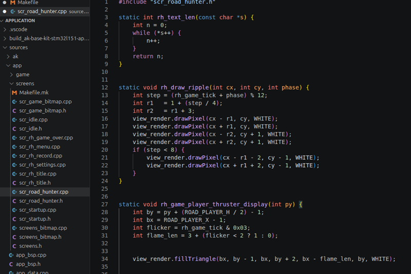

  

#### Example: Displaying the Player Car screen in the Road Hunter game

**Step 3.1 —** Create a header file `scr_road_hunter.h` in the `screens/` directory to declare the functions that draw the Player Car screen:

<p align="center">
  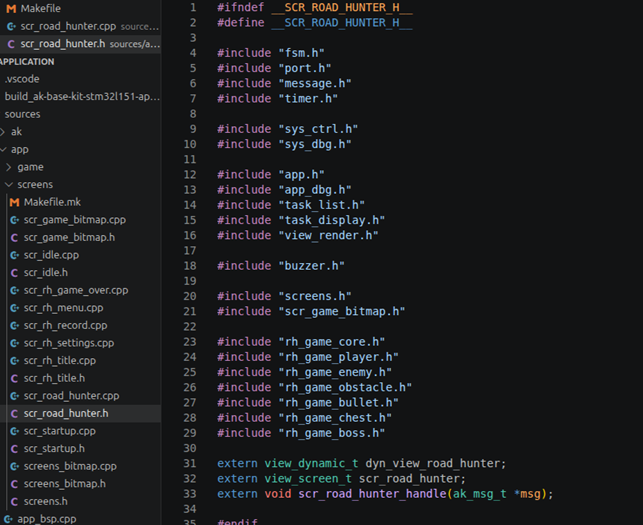

  

**Step 3.2 —** Create `scr_road_hunter.cpp` to handle the bitmap data and render the Player Car on the display:

<p align="center">
  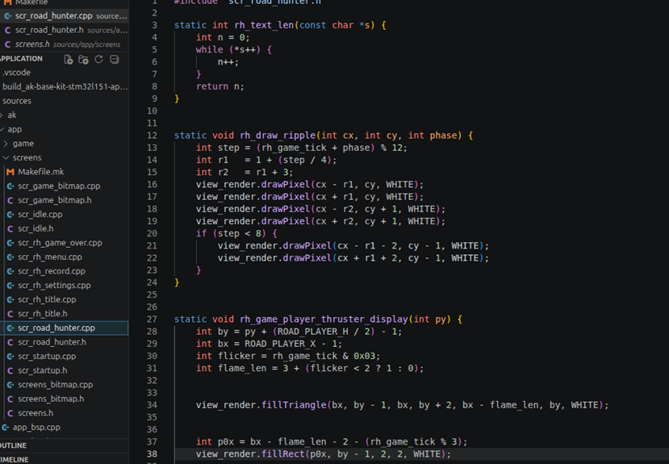

  

**Step 3.3 —** Create a header file `screens_bitmap.h` in the `screens/` directory to declare shared bitmap data:

<p align="center">
  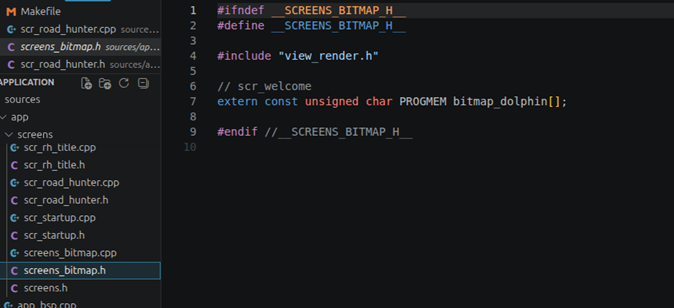

  

**Step 3.4 —** Create `screens_bitmap.cpp` containing the Player Car's bitmap data:

<p align="center">
  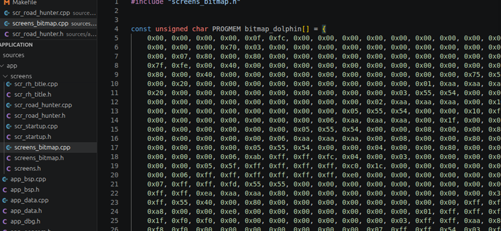

  

**Step 3.5 —** Include the Player Car header file in `task_display.h`:

<p align="center">
  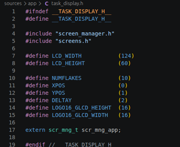

  

**Step 3.6 —** Update the `case AC_DISPLAY_SHOW_IDLE` case:

<p align="center">
  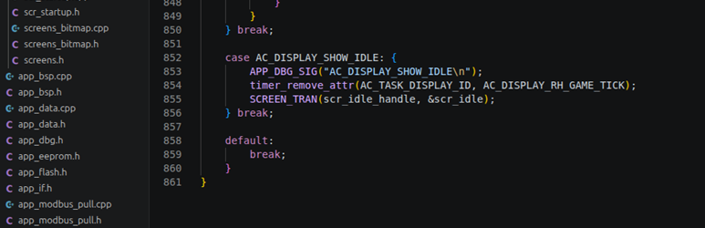


**Step 3.7 —** Add the files inside the `screens/` directory so they get compiled:

<p align="center">
  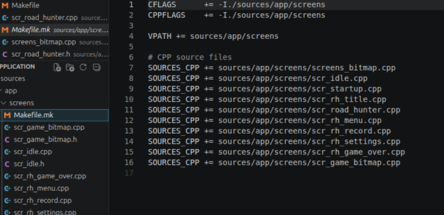


**Step 3.8 —** Build and flash the firmware onto the kit (see detailed instructions in [Section II](#ii-quick-start-guide-environment-setup)):

<p align="center">
  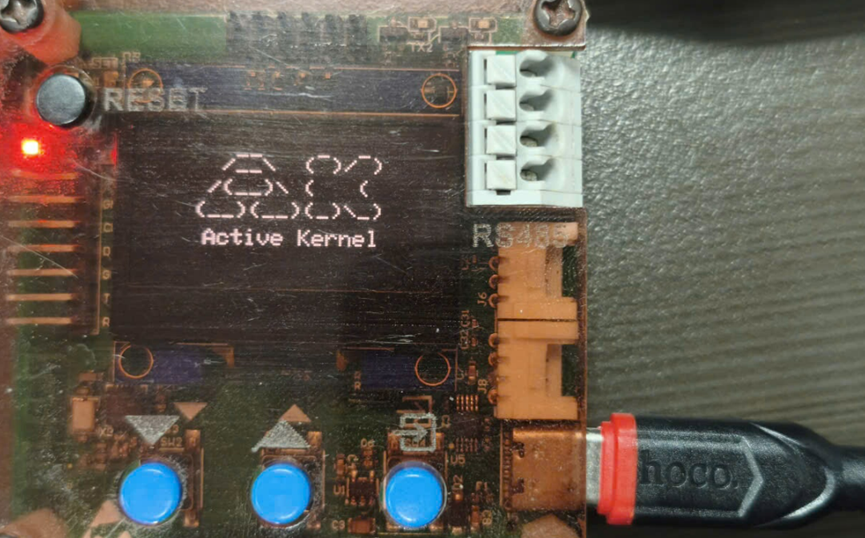


---

### Step 4: Push your code to GitHub

After finishing a feature, save your progress to your personal repo with the commands below (run them from the **root directory** of the repo):

```bash
git add .
git commit -m 
git push origin main
```


**Repository updated on GitHub:**

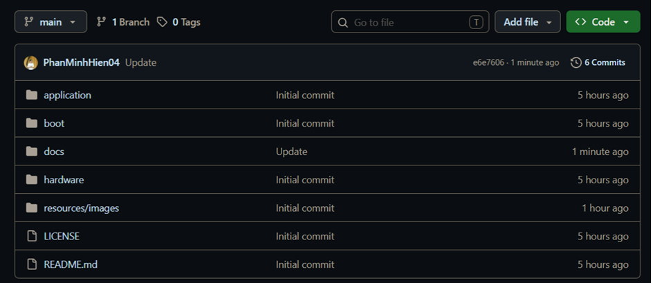


From here, anyone can visit your GitHub link to follow your progress and try out the game you've built.
