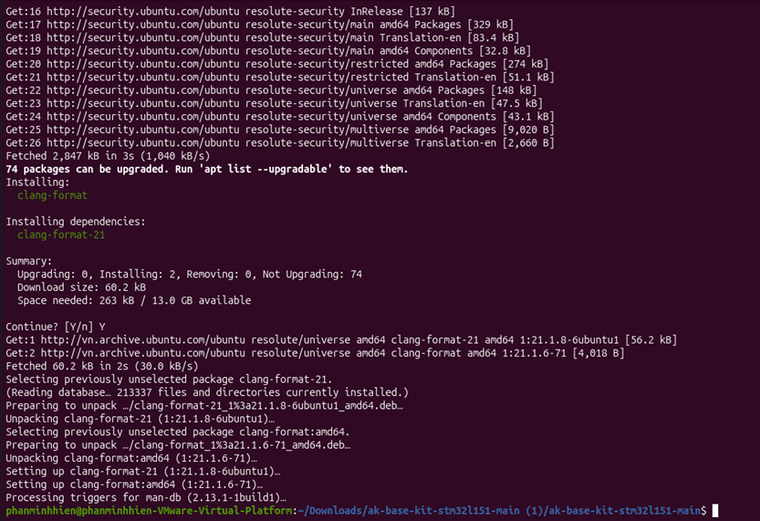
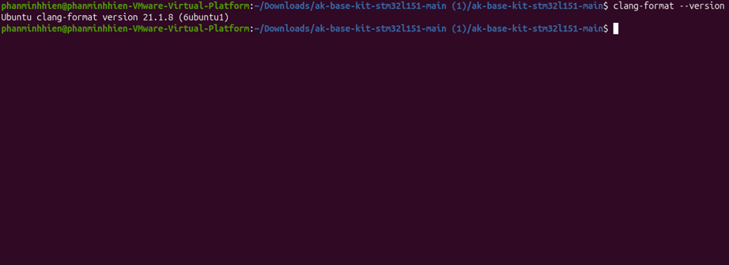
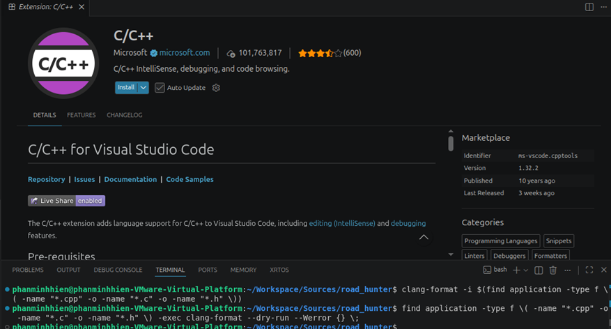
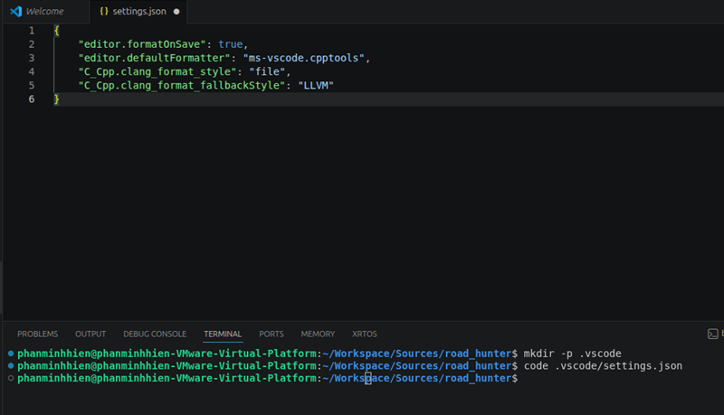
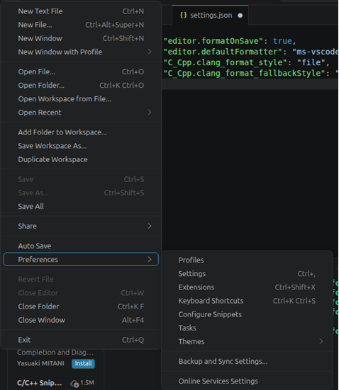
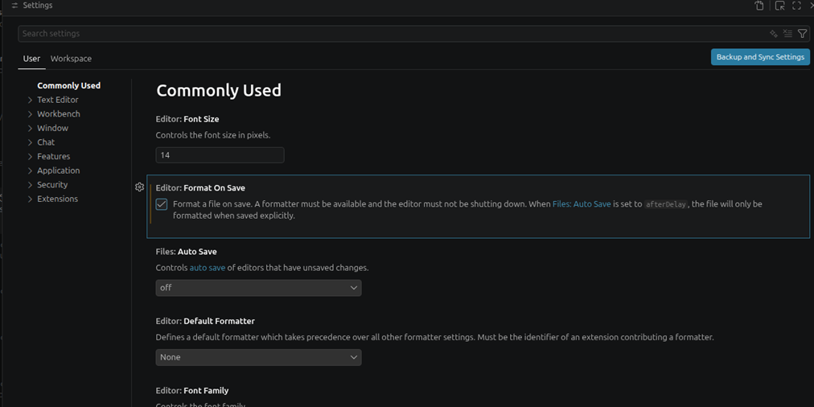

<h1 align="center">Coding rules and style guide</h1>

This document defines the naming conventions, code style, commit message format, and document naming conventions used in the project, along with instructions for installing and using `clang-format`. The goal is to make sure code contributed by team members stays consistent in form and easy to track through search tools, code review, and version control. These are the takeaways from finishing the Road Hunter game — feel free to refer to them and apply whatever fits.

---

## Table of contents

- [I. Naming conventions](#i-naming-conventions)
  - [1. Folder](#1-folder)
  - [2. Source and header files](#2-source-and-header-files)
  - [3. Header guard](#3-header-guard)
  - [4. Macros and compile-time constants](#4-macros-and-compile-time-constants)
  - [5. Signal (enum values)](#5-signal-enum-values)
  - [6. Task ID](#6-task-id)
  - [7. Data types and typedef](#7-data-types-and-typedef)
  - [8. Functions](#8-functions)
  - [9. Variables](#9-variables)
- [II. Code style (clang-format)](#ii-code-style-clang-format)
- [III. Installing clang-format](#iii-installing-clang-format)
- [IV. Running clang-format](#iv-running-clang-format)
- [V. Commit message convention](#v-commit-message-convention)
- [VI. Document file naming convention](#vi-document-file-naming-convention)
- [VII. References](#vii-references)

---

## I. Naming conventions

The conventions below are drawn directly from the existing source code. You can follow these conventions to develop your coding so that tooling, search, and reviewers all work consistently.

**Case styles used in this document:**

| Style | Description | Example in project | Applied to |
|---|---|---|---|
| `lower_snake_case` | Lowercase letters, words separated by underscore `_` | `rh_empower_charge`, `rh_game_update` | Variables, functions, typedefs, source file names, folder names |
| `UPPER_SNAKE_CASE` | Uppercase letters, words separated by underscore `_` | `ROAD_LANE_COUNT`, `AC_DISPLAY_RH_GAME_TICK`, `AC_TASK_DISPLAY_ID` | `#define` constants, signal enums, task IDs, macros |
| `kebab-case` | Lowercase letters, words separated by hyphen `-` | `02-guide-coding-rules.md` | Documentation file names under `docs/` |

### 1. Folder

Use `lower_snake_case` for folder names. Organize by feature (feature-based), not by file type.

```
application/sources/app/
  game/
    road_hunter_game/     # folder holding the source code of all objects of Road Hunter
  screens/                # folder holding the source code of all display screens
  ...
```

### 2. Source and header files

Source and header files always carry a module prefix so you can identify the module right from the file name:

| Prefix | Meaning | Example |
|---|---|---|
| `scr_*` | Handler of a screen | `scr_road_hunter.cpp`, `scr_rh_menu.cpp` |
| `rh_game_*` | Object belonging to the Road Hunter game | `rh_game_player.cpp`, `rh_game_bullet.h` |

Each game defines its own short prefix (for example `rh_game_*` for Road Hunter) and applies it consistently to every file in that game's folder.

File extensions: `.h` for headers, `.cpp` for implementation (the project is built as C++).

### 3. Header guard

Use the pattern `__<FILE_NAME>_H__`, fully uppercased, matching the file name exactly:

```cpp
#ifndef __RH_GAME_PLAYER_H__
#define __RH_GAME_PLAYER_H__
...
#endif //__RH_GAME_PLAYER_H__
```

### 4. Macros and compile-time constants

Use `UPPER_SNAKE_CASE` for names. Always wrap numeric values in parentheses to avoid errors when the macro gets expanded.

**Mandatory rule: a macro that belongs to an object/system should carry a descriptive prefix.**

Pattern: `ROAD_<PROPERTY>` or `RH_<OBJECT>_<PROPERTY>` — the system or object always comes first. Reading the macro name tells you immediately which module it belongs to, and grepping by name returns every constant of that module.

| Constant type | Correct form |
|---|---|
| Count | `ROAD_LANE_COUNT`, `ROAD_MAX_ENEMIES`, `ROAD_MAX_PLAYER_BULLETS` |
| Coordinate | `ROAD_PLAYER_X`, `ROAD_LANE_Y_BASE` |
| Movement speed | `ROAD_BULLET_SPEED`, `ROAD_ENEMY_SPEED_BASE` |
| Size | `ROAD_PLAYER_W`, `ROAD_PLAYER_H`, `RH_TANK_W` |
| Time / interval | `RH_EMPOWER_DURATION`, `RH_BOSS_FIRST_DELAY_TICKS` |
| Health / hit point | `RH_TANK_HP`, `RH_BOSS_LAND_HP` |

Examples:

```cpp
// rh_game_common.h
#define ROAD_LANE_COUNT		  (5)
#define ROAD_PLAYER_X		  (16)
#define ROAD_PLAYER_W		  (14)
#define ROAD_PLAYER_H		  (9)
#define ROAD_LANE_Y_BASE	  (12)
#define ROAD_LANE_STEP		  (9)
#define ROAD_BULLET_SPEED	  (4)
#define ROAD_ENEMY_SPEED_BASE (2)
#define ROAD_MAX_ENEMIES	  (6)
```

Group related constants in the right module header (`rh_game_common.h` holds shared constants, specific headers hold local ones). Never leave magic numbers scattered across `.cpp` files.

### 5. Signal (enum values)

Signals are the **public contract** between tasks. Always use the full prefix — no abbreviations.

In Road Hunter, the gameplay and screens are managed by the display task (`AC_TASK_DISPLAY_ID`). The screen task is driven by the periodic game tick signal `AC_DISPLAY_RH_GAME_TICK` (120ms). Other signals related to buttons or timers are prefixed with `AC_DISPLAY_*` (some button signals contain historical spelling: `AC_DISPLAY_BUTON_*`).

Declare display-related signals in `app.h` inside the Display section:

```cpp
enum {
    AC_DISPLAY_RENDER_SCREEN = AK_SYS_DEFINE_SIG,
    AC_DISPLAY_INITIAL = AK_USER_DEFINE_SIG,
    AC_DISPLAY_BUTON_MODE_PRESSED,
    AC_DISPLAY_BUTON_UP_PRESSED,
    AC_DISPLAY_BUTON_DOWN_PRESSED,
    AC_DISPLAY_SHOW_LOGO,
    AC_DISPLAY_SHOW_IDLE,
    AC_DISPLAY_SCREEN_IDLE,
    AC_DISPLAY_WELCOME_TEXT_ANIM_TICK,
    AC_DISPLAY_RH_GAME_TICK,
    ...
};
```

### 6. Task ID

Road Hunter does not register separate task IDs for individual game objects (like Player, Enemy, Bullet etc.). Instead, the entire game updates synchronously inside the display task `AC_TASK_DISPLAY_ID`. The screen handler receives the periodic `AC_DISPLAY_RH_GAME_TICK` signal and calls `rh_game_update()` to advance all object positions and checks collisions in a single pass.

### 7. Data types and typedef

Use `lower_snake_case` with the `_t` suffix. The struct stays anonymous; the typedef is the public name:

```cpp
typedef struct {
	int16_t x;
	uint8_t lane;
	uint8_t hp;
	uint8_t fire_timer;
	uint8_t rockets_fired;
	bool active;
	bool trapped;
	uint8_t trap_timer;
	bool is_tank;
} rh_game_enemy_t;
```

### 8. Functions

Use `lower_snake_case` with the module name as prefix, so that grepping the prefix returns every entry point of that module:

```cpp
void rh_game_update(void);
void rh_game_player_reset(void);
void rh_game_bullet_autoshoot(void);
const char* rh_game_get_power_name(uint8_t power);
```

### 9. Variables

Use `lower_snake_case`. Do not start names with an underscore.

- **Globals shared between modules:** declare `extern` in the header, define exactly once in the `.cpp` of the owning module.

  ```cpp
  // rh_game_core.h
  extern uint16_t rh_score;
  extern uint8_t rh_game_state;
  extern bool rh_sound_enabled;
  extern uint8_t rh_empower_charge;
  ```

- **Module-internal variables:** declare `static` in the `.cpp`.

  ```cpp
  // rh_game_core.cpp
  static uint16_t rh_spawn_timer = 12;
  ```

- **Local variables:** short, describe the role accurately. Loop counters can use `i`, `j`, `k` when the scope is clear.

State belonging to a game's object should carry that object's name (`rh_player_lane`, `rh_enemies[i].active`); do not stash cross-cutting state inside another module's `.cpp`.

---

## II. Code style (clang-format)

The repo already includes a `.clang-format` file at the root, shown here for reference:

```yaml
Language: Cpp
BasedOnStyle: LLVM
UseTab: ForIndentation
IndentWidth: 4
TabWidth: 4
ColumnLimit: 0
BreakBeforeBraces: Allman
AllowShortIfStatementsOnASingleLine: false
AllowShortFunctionsOnASingleLine: None
AllowShortBlocksOnASingleLine: false
AllowShortCaseLabelsOnASingleLine: false
PointerAlignment: Left
SpaceBeforeParens: ControlStatements
IndentCaseLabels: false
SortIncludes: false
```

What the non-default settings do:

| Setting | Effect |
|---|---|
| `UseTab: ForIndentation`, `IndentWidth: 4`, `TabWidth: 4` | Tabs are used only for indentation, not alignment. One tab equals 4 columns. |
| `ColumnLimit: 0` | No automatic line wrapping. The author decides where to break a line. |
| `BreakBeforeBraces: Allman` | The `{` always sits on its own line — applies to `if`, `for`, and function bodies. |
| `AllowShort*OnASingleLine: false` | One statement per line, even for short `if` statements or empty functions. |
| `PointerAlignment: Left` | Write `int* p`, not `int *p`. |
| `SpaceBeforeParens: ControlStatements` | `if (x)`, `for (...)` have a space; `func(x)` does not. |
| `IndentCaseLabels: false` | `case` labels sit at the same indent level as `switch`. |
| `SortIncludes: false` | Include order is meaningful (BSP → framework → project) and must not be sorted automatically. |

---

## III. Installing clang-format

Instructions for Linux (Ubuntu / Debian).

Install:

```bash
sudo apt update
sudo apt install clang-format
```

<table align="center">
  <tr>
    <td align="center"></td>
  </tr>
</table>


Verify the install:

```bash
clang-format --version
```

Expected output (version number may differ):

```
Ubuntu clang-format version 21.x.x
```

<table align="center">
  <tr>
    <td align="center"></td>
  </tr>
</table>


---

## IV. Running clang-format

### 1. Running from the command line

Format a single file in place:

```bash
clang-format -i application/sources/app/game/road_hunter_game/rh_game_bullet.cpp
```

<table align="center">
  <tr>
    

Format every source and header file under `application/sources/app`:

```bash
find application/sources/app -type f \( -name "*.cpp" -o -name "*.h" \) \
    -not -path "*/libraries/*" \
    -exec clang-format -i {} +
```

---

### 2. VSCode integration

**Step 1.** Install the **C/C++** extension (Microsoft) — it ships with `clang-format` and automatically picks up the `.clang-format` file in the repo.

<table align="center">
  <tr>
    <td align="center"></td>
  </tr>
</table>


**Step 2.** Open the workspace settings (`.vscode/settings.json`) and add the following config:

```json
{
    "editor.formatOnSave": true,
    "editor.defaultFormatter": "ms-vscode.cpptools",
    "C_Cpp.clang_format_style": "file",
    "C_Cpp.clang_format_fallbackStyle": "LLVM"
}
```
<p align="center">
  
</p>

**Step 3.** Format the current file using the shortcut <kbd>Ctrl</kbd>+<kbd>Shift</kbd>+<kbd>I</kbd> (Windows / Linux).

**Step 4.** Turn on `format On Save` so the editor formats the file on every save, making sure no code with stale formatting gets committed.

---
<p align="center">
  
</p>

<p align="center">
  
</p>


## V. Commit message convention

Every commit must follow the format `[ACTION] short description` so the git history stays easy to read and easy to filter.

### 1. Workflow

```bash
git add .                                     # stage every change
git commit -m "[ACTION] short description"    # tag is mandatory, keep description short
git push                                      # push to remote
```

When you only need to stage specific files, replace `git add .` with `git add <path>` to avoid committing junk files by mistake.

### 2. Action tags

| Tag | When to use |
|---|---|
| `[ADD]` | Adding a new file, feature, asset, or document |
| `[UPDATE]` | Updating existing code — refactor, rename, tweak logic, bump version |
| `[FIX]` | Fixing an existing bug, build error, or formatting error |
| `[REMOVE]` | Removing a file, feature, or dead code |
| `[DOC]` | Documentation-only changes (`docs/`, `README.md`, large comment blocks) |
| `[MERGE]` | Branch merges (usually tool-generated, do not hand-edit) |

### 3. Description style

- Tag fully uppercased inside `[]`, followed by exactly one space, then the description.
- Description in lowercase, imperative mood (`add`, `fix`, `rename`, `move`...), no trailing period.
- Keep the length around 70 characters — if longer, shorten it or move the details into the commit body.
- When the change touches a specific module / signal / file, name it directly so the history is easy to grep.

### 4. Good examples

```text
[ADD] boss sky wing weak point logic
[ADD] mermaid game over sequence diagram
[UPDATE] rename buttons to AC_DISPLAY_BUTON_* in settings
[UPDATE] optimize road scrolling wave effect for sea boss
[FIX] correct laser scan x coordinate offset
[DOC] update coding rules for road hunter prefix
```

---

## VI. Document file naming convention

Files in `docs/` follow the format `<NN>-<category>-<topic>.md`:

| Component | Convention | Example |
|---|---|---|
| `NN` | A 2-digit sequence number, starting from `01`. Reflects reading order — guides come first, design docs come after. | `01`, `02`, `03` |
| `category` | Document category. Only use predefined values; do not add new categories. | `guide`, `design` |
| `topic` | Main topic, written in `kebab-case` (lowercase, words separated by `-`). | `getting-started`, `coding-rules`, `sequence-object` |

Categories currently in use:

| Category | Purpose | Typical content |
|---|---|---|
| `guide` | Workflow, setup, and process guides for contributors | Getting started, coding rules |
| `design` | Describes architecture and runtime behavior of the system | Sequence diagrams |

Example of files currently in the repo:

```
docs/
├── 01-guide-getting-started.md
├── 02-guide-coding-rules.md
├── 03-design-sequence-object.md
└── 04-design-sequence-runtime.md
```

Notes:

- Documentation files (`.md`) use `kebab-case` (hyphens). Source files and folders use `snake_case` (underscores).
- Images that go with a document live under `resources/images/<topic_dir>/` (where `<topic_dir>` is snake_case).
- Renaming a documentation file must be done with `git mv` so that the rename history is tracked properly.

---

## VII. References

- [Naming convention — Multi-word identifiers (Wikipedia)](https://en.wikipedia.org/wiki/Naming_convention_(programming)#Multiple-word_identifiers) — definitions of `snake_case`, `SCREAMING_SNAKE_CASE`, and `kebab-case` used in Sections I and VI.
- [Clang-Format — Configurable Format Style Options](https://clang.llvm.org/docs/ClangFormatStyleOptions.html#configurable-format-style-options) — describes every key in the `.clang-format` file from Section II.
- [Pro Git — Recording Changes to the Repository](https://git-scm.com/book/en/v2/Git-Basics-Recording-Changes-to-the-Repository) — the `git add` / `git commit` / `git push` workflow used in Section V.

---

## Contact & Support

<p style="font-size: 20px;"><strong>Phan Minh Hien</strong> - Software Engineer - Embedded Systems</p>

```
Thanks for stopping by this repository.
If you have any questions, suggestions, or feedback about this project
or about firmware development in general, feel free to reach out to me directly.
```

<a href="https://github.com/PhanMinhHien04">
  
</a>

<a href="https://www.linkedin.com/in/hien-phan-37337540b/">
  
</a>

<a href="mailto:phanminhhien2004@gmail.com">
  
</a>
