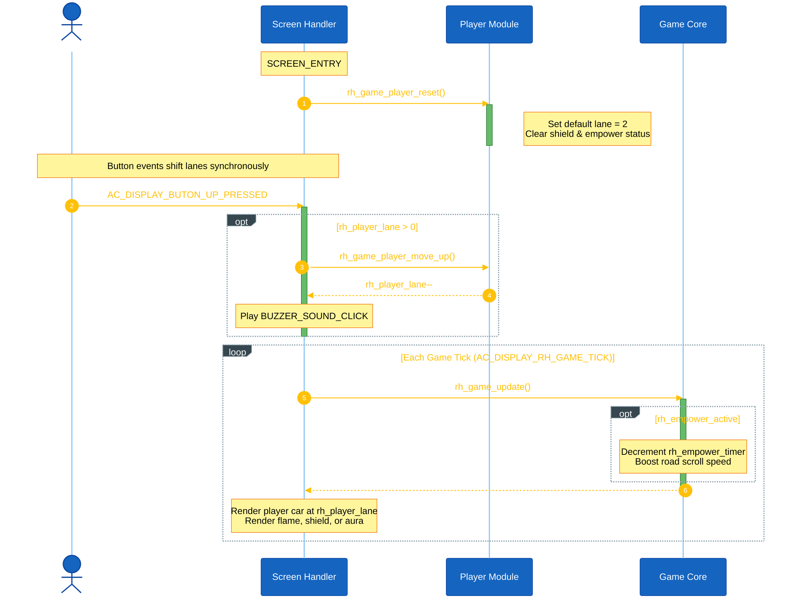
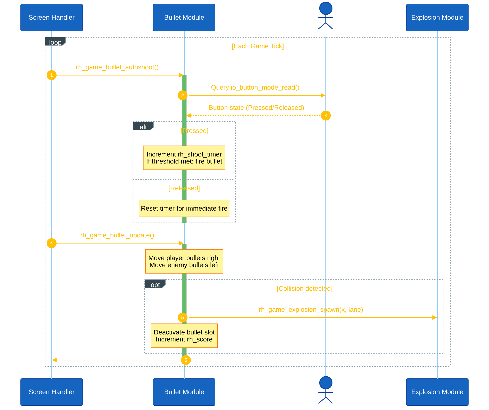
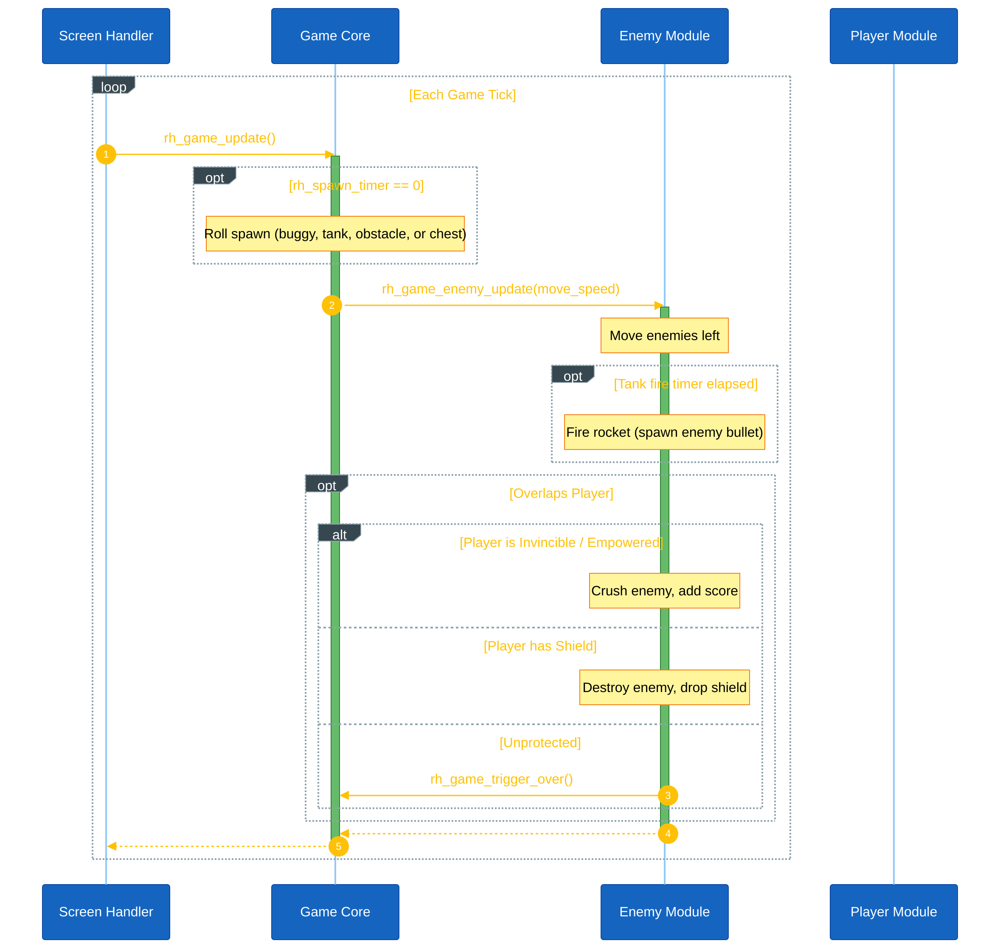
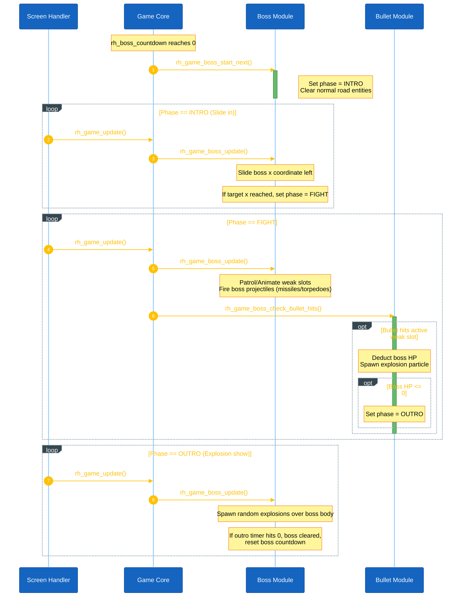

<h1 align="center">Game Object Sequences</h1>

This document describes the runtime sequence and design details of each main object module in Road Hunter. Unlike Zomwar, which registers a dedicated AK task for each game entity, Road Hunter updates all gameplay objects synchronously within a single loop driven by the display task tick handler (`AC_DISPLAY_RH_GAME_TICK` at 120ms rate).

---

## I. Object Module Summary

| Module | Files | Main Responsibility |
|---|---|---|
| **Player** | [rh_game_player.h](file:///l:/AK/game2107-main%20%288%29/game2107-main/application/sources/app/game/road_hunter_game/rh_game_player.h) [rh_game_player.cpp](file:///l:/AK/game2107-main%20%288%29/game2107-main/application/sources/app/game/road_hunter_game/rh_game_player.cpp) | Tracks player lane coordinate (`rh_player_lane`), updates thruster and empower animations, and manages invincibility and shield status. |
| **Bullet & Laser** | [rh_game_bullet.h](file:///l:/AK/game2107-main%20%288%29/game2107-main/application/sources/app/game/road_hunter_game/rh_game_bullet.h) [rh_game_bullet.cpp](file:///l:/AK/game2107-main%20%288%29/game2107-main/application/sources/app/game/road_hunter_game/rh_game_bullet.cpp) | Manages player bullets (normal/special types), enemy rockets, and explosion particles. Triggers automatic mode-button shooting and scans lane sweeps for the Laser power-up. |
| **Enemy** | [rh_game_enemy.h](file:///l:/AK/game2107-main%20%288%29/game2107-main/application/sources/app/game/road_hunter_game/rh_game_enemy.h) [rh_game_enemy.cpp](file:///l:/AK/game2107-main%20%288%29/game2107-main/application/sources/app/game/road_hunter_game/rh_game_enemy.cpp) | Spawns and moves buggy and tank enemies, handles tank shooting, and reports targets killed to charge the player's Empower bar. |
| **Obstacle** | [rh_game_obstacle.h](file:///l:/AK/game2107-main%20%288%29/game2107-main/application/sources/app/game/road_hunter_game/rh_game_obstacle.h) [rh_game_obstacle.cpp](file:///l:/AK/game2107-main%20%288%29/game2107-main/application/sources/app/game/road_hunter_game/rh_game_obstacle.cpp) | Spawns static barriers (fences, cones, cargo crates) and moving hazards (cars, trucks). |
| **Chest** | [rh_game_chest.h](file:///l:/AK/game2107-main%20%288%29/game2107-main/application/sources/app/game/road_hunter_game/rh_game_chest.h) [rh_game_chest.cpp](file:///l:/AK/game2107-main%20%288%29/game2107-main/application/sources/app/game/road_hunter_game/rh_game_chest.cpp) | Spawns and rolls special weapon chests (Gatling, Piercing, Explosive, Spider, Laser, Shield) moving along the road lanes. |
| **Boss** | [rh_game_boss.h](file:///l:/AK/game2107-main%20%288%29/game2107-main/application/sources/app/game/road_hunter_game/rh_game_boss.h) [rh_game_boss.cpp](file:///l:/AK/game2107-main%20%288%29/game2107-main/application/sources/app/game/road_hunter_game/rh_game_boss.cpp) | Controls Land Tank, Sea Warship, and Sky Aircraft boss battles. Dictates fight phases (intro slide, live weak slots, and outro explosions) and manages boss projectiles (shells, mines, torpedoes, missiles). |
| **Screen Handler** | [scr_road_hunter.h](file:///l:/AK/game2107-main%20%288%29/game2107-main/application/sources/app/screens/scr_road_hunter.h) [scr_road_hunter.cpp](file:///l:/AK/game2107-main%20%288%29/game2107-main/application/sources/app/screens/scr_road_hunter.cpp) | Serves as the UI screen container, receives periodic tick signals, routes buttons, and renders the backdrop and HUD. |

---

## II. Player Module Sequence

The Player module controls the player vehicle coordinates and attributes (lane position `rh_player_lane` in range `0..4`, invincibility state, and shield status).

**Input:** Buttons `AC_DISPLAY_BUTON_UP_PRESSED` and `AC_DISPLAY_BUTON_DOWN_PRESSED` trigger immediate lane changes. The screen handler calls `rh_game_player_move_up()` or `rh_game_player_move_down()` to update `rh_player_lane` and plays a click sound.

**Per-tick:** The game loop queries player conditions:
- Checks if the Empower charge (`rh_empower_charge`) has reached `5`. If so, it activates the `rh_empower_active` buff, setting invincibility, boosting road scroll speed, and decreasing the buffer timer (`rh_empower_timer`).
- While Empower is active, collision tests are bypassed so the player rams through any enemies/obstacles unharmed.

**Rendering:** Draws the player vehicle (`bitmap_car`). If the Sea Boss is active, the sprite is swapped with a boat hull (`rh_game_player_boat_hull_display`). If the Sky Boss is active, wings are rendered on the vehicle side. It also renders the flickering thruster flame, active shield rect, and empowerment aura spikes.

<strong>*Figure 1:*</strong> Player module sequence logic

---

## III. Bullet & Laser Module Sequence

The Bullet module coordinates shooting from player input, manages projectile movements (player bullets step right, enemy bullets step left), and registers explosion effects.

**Autoshoot:** During each game update tick, the system calls `rh_game_bullet_autoshoot()`. This function queries the raw hardware Mode button state (`io_button_mode_read()`). If the button is held down:
- The bullet timer (`rh_shoot_timer`) increments. Once it crosses the fire interval (1 tick for Gatling, 3 ticks normally), it triggers `rh_game_bullet_fire()` to allocate a free slot in the `rh_player_bullets[]` array.
- If the button is released, the timer resets to maximum, ensuring an immediate shot upon the next press.

**Updates & Collisions:** During `rh_game_bullet_update()`:
- Active player bullets move right by speed `ROAD_BULLET_SPEED`. If they hit an enemy or obstacle, they deduct HP, trigger explosion particles (`rh_game_explosion_spawn()`), add points to `rh_score`, and deactivate (unless a piercing shot).
- If the Laser power-up is active, the game calls `rh_game_laser_update()` instead of spawning bullets. The laser scans coordinates to the right of the player, instantly hitting and destroying all objects in the player's lane.
- Active enemy bullets move left, testing for collision with the player vehicle.

<strong>*Figure 2:*</strong> Bullet module shooting and collision sequence

---

## IV. Enemy & Obstacle Module Sequence

Enemies (normal buggies and rockets-firing tanks) and obstacles (traffic cones, fences, cargo trucks, and parked cars) scroll left along the road coordinates.

**Spawning:** During normal gameplay, a spawn timer (`rh_spawn_timer`) ticks down. When it reaches 0, a random roll determines what to spawn on the right screen border (`x = 127`):
- 23% chance: Normal Enemy Buggy
- 7% chance: Armored Enemy Tank (HP = 2)
- 25% chance: Obstacle (Cone / Fence / Crate / Truck / Car)
- 10% chance: Upgrade Chest
- Otherwise: No spawn, reset timer.

**Movement & Attacks:**
- Active enemies and obstacles step left by `move_speed` (derived from difficulty). If they cross `x < -30`, they deactivate.
- Active tanks decrement a burst timer. When expired, they fire a burst of 3 rockets in their lane toward the player.
- In `rh_game_enemy_update()` and `rh_game_obstacle_update()`, if any active entity overlaps the player vehicle (`ROAD_PLAYER_X`):
  - If the player is in Empowered state: the entity is instantly crushed, adding score.
  - If the player has a Shield active: the shield is consumed, the entity is destroyed, and the player is granted a brief invincibility frame.
  - If unprotected: the player vehicle is destroyed, triggering `rh_game_trigger_over()`.

<strong>*Figure 3:*</strong> Enemy update and collision sequence

---

## V. Chest Module Sequence

Chests spawn on lanes and move left, granting power-ups upon player contact.

**Spawning:** Spawns via the central core random generator and rolls a target weapon slot:
- `RH_POWER_GATLING`: Extremely fast firing rate.
- `RH_POWER_PIERCING`: Bullets fly straight through enemies without dissolving.
- `RH_POWER_EXPLOSIVE`: Heavy shells that explode, hitting enemies in adjacent lanes.
- `RH_POWER_SPIDER`: Fires a web projectile trapping enemies in place.
- `RH_POWER_LASER`: Fires a continuous beam sweeping the lane.
- `RH_POWER_SHIELD`: Deploys a protective shield outline around the car.

**Collection:** In `rh_game_chest_update()`, if a chest overlaps the player vehicle, it plays `BUZZER_SOUND_HIGHSCORE` (if sound enabled), sets `rh_active_power` to the chest's item type, loads `rh_power_timer = 100` (lasts ~10s), and deactivates the chest. Empowered players cannot collect chests.

---

## VI. Boss Module Sequence

Boss battles trigger periodically (every 20 seconds / 167 ticks) on a countdown timer. While a boss encounter is active, the normal road entities are cleared, and the boss slides in.

The game cycles through three bosses:
1. **Land Boss (Tank):** Occupies 3 lanes, patrols up and down the road. Spawns shootable shells and scattered road mines.
2. **Sea Boss (Warship):** Occupies all 5 lanes (full screen width). Spawns fast torpedoes.
3. **Sky Boss (Aircraft):** Sweeps in a 3-lane band. Spawns homing missiles. Its wing wingtips are weak points and only take damage when they are lit/blinking.

**Boss Phases:**
- **RH_BOSS_PHASE_INTRO:** The road clears, and the boss slides left onto the screen (`x` moves from 140 to target position). The boss is immune.
- **RH_BOSS_PHASE_FIGHT:** The boss attacks and exposes a weak point in one of its occupied lanes (weak slot blinks). Player bullets hitting this weak slot deduct boss HP.
- **RH_BOSS_PHASE_OUTRO:** HP reaches 0. The boss stops firing and plays explosion particles over several frames before disappearing.

<strong>*Figure 4:*</strong> Boss phase transition and battle sequence

---

## VII. Code References

| Module | Source File | Header File |
|---|---|---|
| **Player** | `application/sources/app/game/road_hunter_game/rh_game_player.cpp` | `application/sources/app/game/road_hunter_game/rh_game_player.h` |
| **Bullet** | `application/sources/app/game/road_hunter_game/rh_game_bullet.cpp` | `application/sources/app/game/road_hunter_game/rh_game_bullet.h` |
| **Enemy** | `application/sources/app/game/road_hunter_game/rh_game_enemy.cpp` | `application/sources/app/game/road_hunter_game/rh_game_enemy.h` |
| **Obstacle** | `application/sources/app/game/road_hunter_game/rh_game_obstacle.cpp` | `application/sources/app/game/road_hunter_game/rh_game_obstacle.h` |
| **Chest** | `application/sources/app/game/road_hunter_game/rh_game_chest.cpp` | `application/sources/app/game/road_hunter_game/rh_game_chest.h` |
| **Boss** | `application/sources/app/game/road_hunter_game/rh_game_boss.cpp` | `application/sources/app/game/road_hunter_game/rh_game_boss.h` |
| **Common Defs** | — | `application/sources/app/game/road_hunter_game/rh_game_common.h` |
| **Core Loop** | `application/sources/app/game/road_hunter_game/rh_game_core.cpp` | `application/sources/app/game/road_hunter_game/rh_game_core.h` |
| **Screen** | `application/sources/app/screens/scr_road_hunter.cpp` | `application/sources/app/screens/scr_road_hunter.h` |
