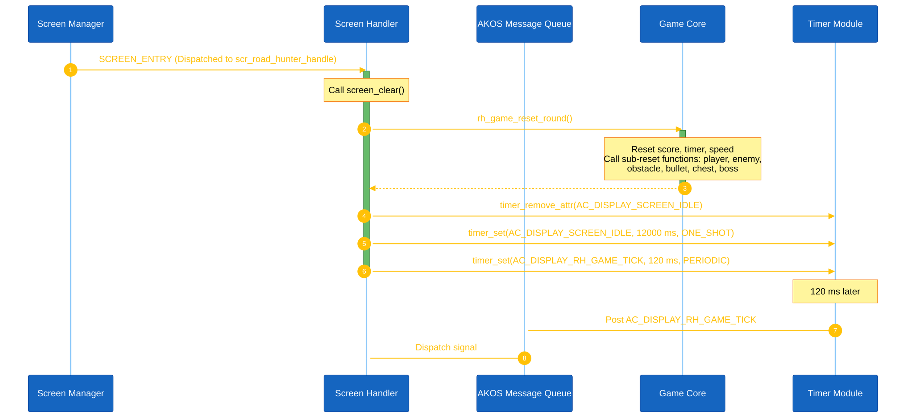
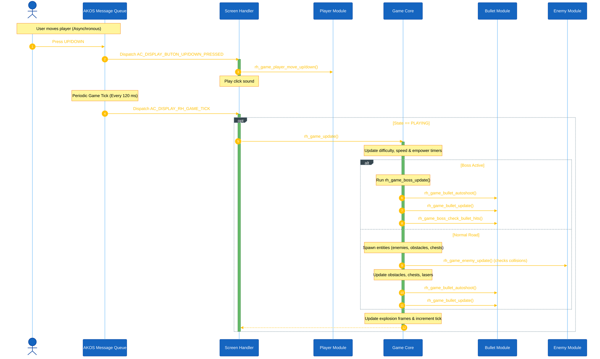
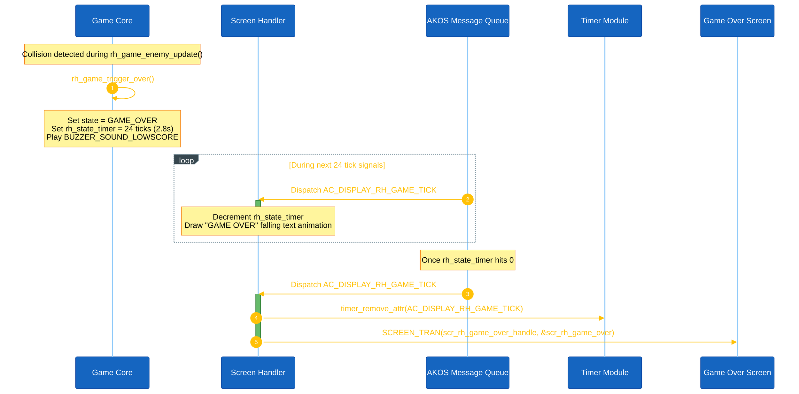

<h1 align="center">Runtime Signal Processing</h1>

This document explains how the Road Hunter game processes button input, timer signals, game-loop updates, and state transitions. Road Hunter operates under the AK event-driven task architecture, but simplifies entity execution: instead of running multiple asynchronous tasks for each game object, all updates and collision tests run synchronously within the display task (`AC_TASK_DISPLAY_ID`) on a periodic game tick.

---

## I. Overview

The Road Hunter application is centered around the display task (`AC_TASK_DISPLAY_ID`), which controls screen-level transitions, button events routing, and periodic display refreshes.

**The Game Loop Timer:**
- Signal: `AC_DISPLAY_RH_GAME_TICK`
- Task Destination: `AC_TASK_DISPLAY_ID`
- Rate: `AC_DISPLAY_RH_GAME_TICK_INTERVAL = 120 ms` (approx. 8.3 ticks per second)

**Main Runtime Flow:**
1. Hardware interrupts (buttons, timers) register signals into the AK message pool.
2. The AK scheduler dispatches messages to the display task handler.
3. For user buttons (UP/DOWN), the handler calls player movement functions immediately to change lanes.
4. On `AC_DISPLAY_RH_GAME_TICK`, the screen handler calls the game loop update function `rh_game_update()` to advance coordinates, spawn hazards, autoshoot bullets, and check collisions in a single synchronous pass.
5. Finally, the display manager draws the active screen, writing pixels to the OLED buffer and pushing the frame.

---

## II. High Level Architecture

### 1. Game Start Sequence
When the screen manager switches focus to the Road Hunter gameplay screen, it sends a `SCREEN_ENTRY` signal to `scr_road_hunter_handle()`. This clears the screen, resets variables, and arms the 120ms periodic tick timer.

<strong>*Figure 1:*</strong> Game start runtime sequence

---

### 2. Game Playing Loop
During gameplay, user movement is processed instantly upon receiving button pressed signals. The main game tick updates coordinates and runs collision detection synchronously.

<strong>*Figure 2:*</strong> Gameplay loop tick sequence

---

### 3. Game Over & Reset Sequence
If an enemy or obstacle collides with the player car without a shield/empowerment buff, the core invokes `rh_game_trigger_over()`. This plays a falling text animation before transferring control to the summary screen.

<strong>*Figure 3:*</strong> Game over and transition sequence

---

## III. Button Event Routing

Button callbacks are registered globally in the Board Support Package (`app_bsp.cpp`) and post events to the display task (`AC_TASK_DISPLAY_ID`). The active screen handler intercepts these signals and runs local code.

| Button Callback | Posted Signal | Target Task | Action in Main Screen (`scr_road_hunter.cpp`) | Action in Game Over Screen (`scr_rh_game_over.cpp`) |
|---|---|---|---|---|
| **UP Pressed** | `AC_DISPLAY_BUTON_UP_PRESSED` | `AC_TASK_DISPLAY_ID` | Moves player up one lane: `rh_game_player_move_up()`. | Moves selection focus up. |
| **DOWN Pressed** | `AC_DISPLAY_BUTON_DOWN_PRESSED` | `AC_TASK_DISPLAY_ID` | Moves player down one lane: `rh_game_player_move_down()`. | Moves selection focus down. |
| **MODE Pressed** | `AC_DISPLAY_BUTON_MODE_PRESSED` | `AC_TASK_DISPLAY_ID` | *Ignored.* Mode button is instead queried directly in the game loop. | Activates highlighted option (Retry or Menu). |

> **Note on Mode Button:** To support hold-to-fire and Gatling continuous fire, the Mode button is read directly as a raw hardware input (`io_button_mode_read()`) inside the game loop on every tick rather than acting on asynchronous button signals.

---

## IV. Task Ownership

All game variables and modules are executed within the context of the display task `AC_TASK_DISPLAY_ID`.

| Module | Data Owned | Functions Called |
|---|---|---|
| **Screen Handler** | `rh_game_tick`, `rh_state_timer` | `rh_game_reset_round()`, `rh_game_update()` |
| **Player Module** | `rh_player_lane` | `rh_game_player_move_up()`, `rh_game_player_move_down()`, `rh_game_player_reset()` |
| **Bullet Module** | `rh_player_bullets[]`, `rh_enemy_bullets[]`, `rh_explosions[]`, `rh_shoot_timer` | `rh_game_bullet_autoshoot()`, `rh_game_bullet_update()`, `rh_game_bullet_reset()` |
| **Enemy Module** | `rh_enemies[]`, `rh_enemy_kill_counter` | `rh_game_enemy_update()`, `rh_game_enemy_reset()`, `rh_game_enemy_spawn()` |
| **Obstacle Module** | `rh_obstacles[]` | `rh_game_obstacle_update()`, `rh_game_obstacle_reset()`, `rh_game_obstacle_spawn()` |
| **Chest Module** | `rh_chests[]`, `rh_active_power`, `rh_power_timer`, `rh_shield_active` | `rh_game_chest_update()`, `rh_game_chest_reset()`, `rh_game_chest_spawn()` |
| **Boss Module** | `rh_boss`, `rh_boss_projectiles[]`, `rh_boss_countdown` | `rh_game_boss_update()`, `rh_game_boss_reset()`, `rh_game_boss_start_next()` |
